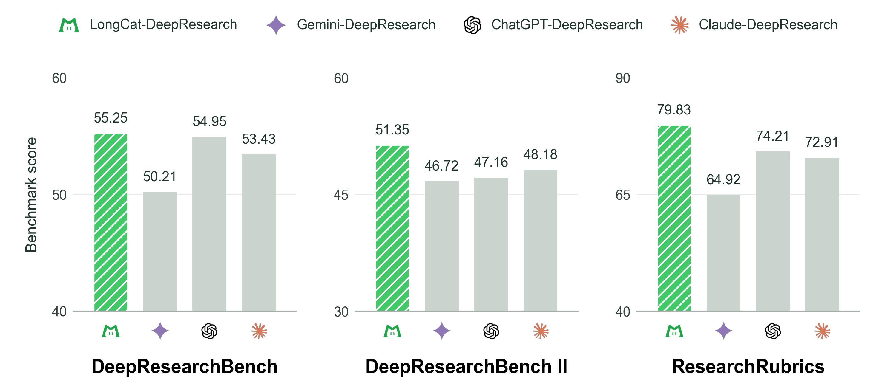
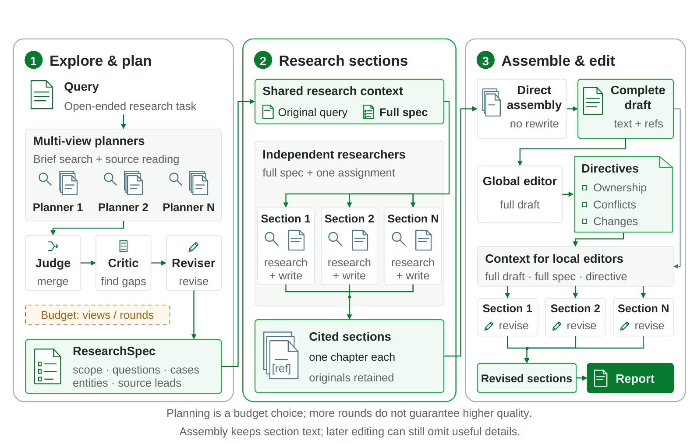
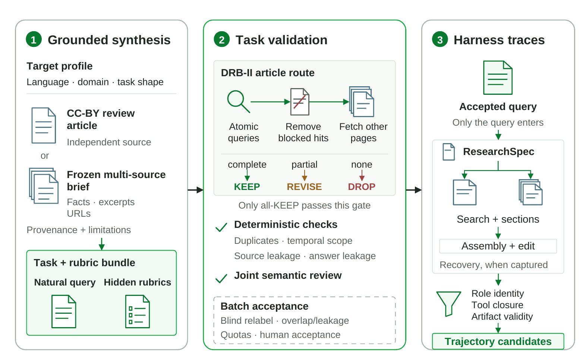

<p align="center"><sub><strong>Plan globally. Research independently. Synthesize coherently.</strong></sub></p>

<p align="center"><a href="https://meituan-longcat.github.io/LongCat-DeepResearch/"></a>&nbsp;<a href="https://github.com/meituan-longcat/LongCat-DeepResearch/blob/main/technical_report/LongCat-DeepResearch.pdf"></a>&nbsp;<a href="https://github.com/meituan-longcat/LongCat-DeepResearch"></a>&nbsp;<a href="https://github.com/meituan-longcat/LongCat-DeepResearch/blob/main/LICENSE"></a></p>

<p align="center"><strong>English</strong> | <a href="https://github.com/meituan-longcat/LongCat-DeepResearch/blob/main/README_zh-CN.md">简体中文</a></p>

## **Overview**

This repository open-sources the LongCat-DeepResearch harness for open-ended research. It captures evolving research requirements in an executable ResearchSpec, supports independent section research and writing, and makes targeted revisions to the assembled report instead of repeatedly rewriting it. Users can run deep-research tasks with their own services by implementing `llm`, `web_search`, and `web_fetch` according to the backend contract. Paired with our LongCat-2.0-based model enhanced for deep research, the complete system outperforms the Deep Research offerings from ChatGPT, Claude, and Gemini on DeepResearchBench, DeepResearchBench II, and ResearchRubrics.

<span style="display:inline-block;width:660px;max-width:100%"></span>

## **Research Harness**



The harness follows three stages:

1. <strong>Explore and plan.</strong> Multiple planners inspect the problem and early sources. A judge merges proposals, a critic identifies gaps, and a reviser produces the executable ResearchSpec.
2. <strong>Research sections.</strong> Independent researchers investigate and write assigned sections in separate contexts while retaining the full specification.
3. <strong>Assemble and edit.</strong> Completed sections are assembled directly. A global editor identifies ownership and consistency issues, and local editors apply section-scoped revisions.

## **Research Data Construction**



The evidence-grounded research-data construction pipeline builds research questions and task-specific rubrics from an independent CC-BY review article or a frozen multi-source brief, validates evidence support, searchability, leakage, and task quality, and collects and filters stage-specific harness trajectories from accepted queries.

This repository releases only the research harness. The data-construction pipeline, generated datasets, hidden rubrics, training trajectories, and training code are not included.

## **Quick Start**

The harness itself uses only the Python standard library and supports Python 3.10 or newer. Install the repository in editable mode:

~~~bash
python3 -m venv .venv
source .venv/bin/activate
python -m pip install -e .
~~~

To run it, provide one Python object with three methods:

- <code>llm</code> sends an OpenAI Chat Completions/function-calling request to your model and returns the provider's response as a dictionary.
- <code>web_search</code> receives one query and returns normalized search results.
- <code>web_fetch</code> receives one or more URLs and returns normalized readable pages in the same order.

No hosted backend is bundled because model, search, and page-fetching services normally require account-specific credentials. Create <code>local_backend.py</code> in the repository root. It is already ignored by Git, so credentials and provider-specific code remain local:

~~~python
class Backend:
    def llm(self, request: dict) -> dict:
        # request: {"model", "messages", "stream", "max_tokens", ...}
        # return: {"choices": [{"message": {...}, "finish_reason": "..."}]}
        raise NotImplementedError

    def web_search(self, request: dict) -> dict:
        # request: {"query": str, "top_k": int}
        # return: {"results": [{"title": str, "url": str,
        #                       "snippet": str, "published_at": str | None}]}
        raise NotImplementedError

    def web_fetch(self, request: dict) -> dict:
        # request: {"urls": [str, ...]}
        # return: {"pages": [{"url": str, "title": str,
        #                     "text": str, "error": str | None}, ...]}
        raise NotImplementedError


def create_backend():
    return Backend()
~~~

Set the module and model name, then verify the three configured services. The smoke command makes one small model request, one search request, and one page-fetch request; it does not generate a research report:

~~~bash
export DR_BACKEND_MODULE=local_backend
export DR_MODEL=your-model-name

scripts/run_smoke.sh
~~~

Run the complete research harness separately:

~~~bash
export DR_BACKEND_MODULE=local_backend
export DR_MODEL=your-model-name

printf '%s\n' 'What question should the system research?' > question.txt
scripts/run_standard.sh question.txt runs
~~~

The final report is written to <code>runs/&lt;question_hash&gt;/report_final.md</code>. Intermediate planning, section research, and editing artifacts remain under the same run directory for inspection.

For library use, inject the backend directly:

~~~python
from longcat_deepresearch import LongCatDeepResearch

result = LongCatDeepResearch(backend=my_backend).run(
    "What question should the system research?",
    run_root="runs",
)
print(result.final_path)
~~~

## **Backend Contract**

The backend is a transport boundary: the harness decides when to call the model and tools, while your backend decides how to authenticate and talk to external services. The harness passes <code>web_search</code> and <code>web_fetch</code> as OpenAI-style function tools in <code>llm</code> requests. If the model returns a tool call, the harness executes the corresponding backend method and sends the tool result back to the model in the next turn.

The public interface is defined in [<code>longcat_deepresearch/backend.py</code>](longcat_deepresearch/backend.py). Every method accepts one Python dictionary and returns one Python dictionary:

| Method | Request supplied by the harness | Required response |
|---|---|---|
| <code>llm</code> | <code>model</code>, <code>messages</code>, <code>stream=false</code>, <code>max_tokens</code>, and optional <code>tools</code>/<code>tool_choice</code> | An OpenAI Chat Completions-compatible object containing <code>choices[0].message</code> |
| <code>web_search</code> | <code>{"query": "...", "top_k": 8}</code>; <code>top_k</code> is between 1 and 10 | <code>{"results": [...]}</code> with normalized title, URL, snippet, and optional publication date |
| <code>web_fetch</code> | <code>{"urls": ["https://..."]}</code> with 1–10 HTTP(S) URLs | <code>{"pages": [...]}</code> with exactly one page per requested URL, in request order |

For a terminal model answer, <code>llm</code> returns:

~~~json
{
  "choices": [
    {
      "message": {"role": "assistant", "content": "The answer or report text."},
      "finish_reason": "stop"
    }
  ]
}
~~~

For a model-requested tool call, <code>message.content</code> may be <code>null</code>. The function <code>arguments</code> value must be a JSON-encoded string, not a nested object:

~~~json
{
  "choices": [
    {
      "message": {
        "role": "assistant",
        "content": null,
        "tool_calls": [
          {
            "id": "call_1",
            "type": "function",
            "function": {
              "name": "web_search",
              "arguments": "{\"query\":\"example\",\"top_k\":5}"
            }
          }
        ]
      },
      "finish_reason": "tool_calls"
    }
  ]
}
~~~

A normalized search response looks like this:

~~~json
{
  "results": [
    {
      "title": "Source title",
      "url": "https://example.org/source",
      "snippet": "Short search-result summary.",
      "published_at": "2026-01-01"
    }
  ]
}
~~~

A normalized fetch response looks like this:

~~~json
{
  "pages": [
    {
      "url": "https://example.org/source",
      "title": "Source title",
      "text": "Readable page text.",
      "error": null
    }
  ]
}
~~~

See [the complete backend interface](docs/BACKEND_INTERFACE.md) for field-level rules and a multi-URL fetch example. The backend owns authentication, networking, redirects, timeouts, retries, rate limits, provider-specific fields, response-size limits, thread safety, and private/link-local network blocking.

## **Repository Structure**

~~~text
.
├── assets/                 # README figures and visual assets
├── docs/                   # Detailed backend contract
├── longcat_deepresearch/   # Installable Python package and CLI
├── scripts/                # CLI and release checks
├── technical_report/       # Latest technical report PDF
├── tests/                  # Offline interface and end-to-end tests
└── pyproject.toml          # Package metadata and development tooling
~~~

## **Testing**

All tests use fake backends and make no external requests.

~~~bash
python -m pip install -e ".[dev]"
python3 -m unittest discover -s tests -v
ruff check . --exclude .venv
python3 scripts/open_source_preflight.py
~~~

## **Limitations and Responsible Use**

Generated reports may contain unsupported claims, incorrect citations, unsafe recommendations, or omissions introduced during editing. Operators must review outputs, respect website terms and robots policies, protect personal information, and obtain authorization for every model, dataset, and service connected to the harness.

Backend implementations must treat retrieved content as untrusted input, prevent access to private and link-local network destinations, protect credentials, and avoid logging authorization headers or private prompts.

Do not disclose vulnerabilities in public issues. Use the repository's private security-reporting channel and include the affected version, reproduction steps, and expected impact.

## **Citation**

If you find this project useful, please cite:

```bibtex
@techreport{longcatdeepresearch2026,
  title  = {LongCat-DeepResearch Technical Report},
  author = {
    Meituan LongCat Team and He Zhu and Yue Xu and
    Xunliang Cai and Yan Chen and Fan Yang and
    Lingchuan Liu and others
  },
  year   = {2026}
}
```

## **License**

Copyright 2026 LongCat.

This project is released under the [MIT License](LICENSE).
